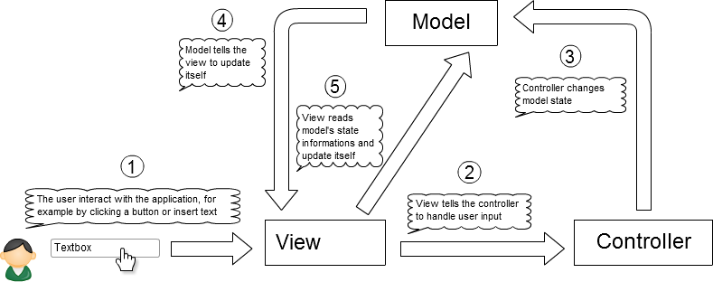

Minimalistic MVC Example AS3
============================

This is a minimalistic implementation of the MVC design pattern written in AS3.
The built program will only trace the key code of the pressed keyboard button in the output panel. 

### Run unit test

- Add vendor/as3/src and test/src classpath 
	(with flashdevelop right click on the project name, properties, classpath label )
- Set tests/src/Runner.as as document class 
	(with flashdevelop right click on the class file the select 'Set Document Class')
- Run the project 
	(with flashdevelop press F5).

### Info

Built using Flash Develop http://www.flashdevelop.org/
	
### TODO

Use composer for dependencies.
	
### Reference

- O'Really Actionscript 3.0 Design Patterns

